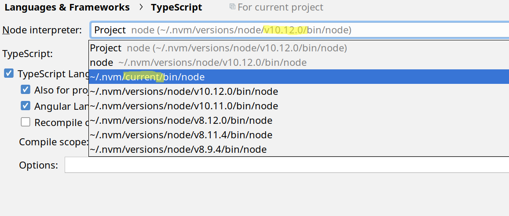
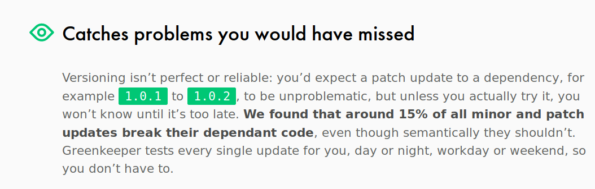
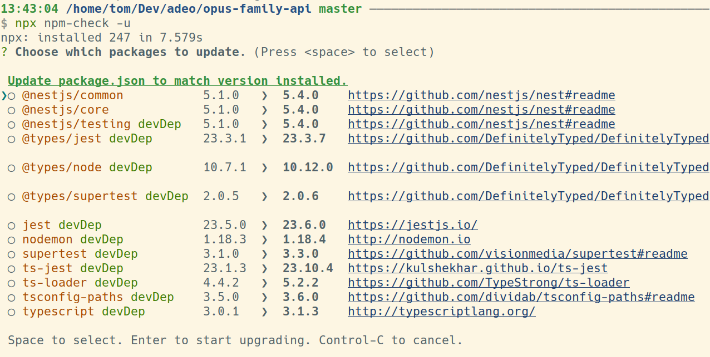
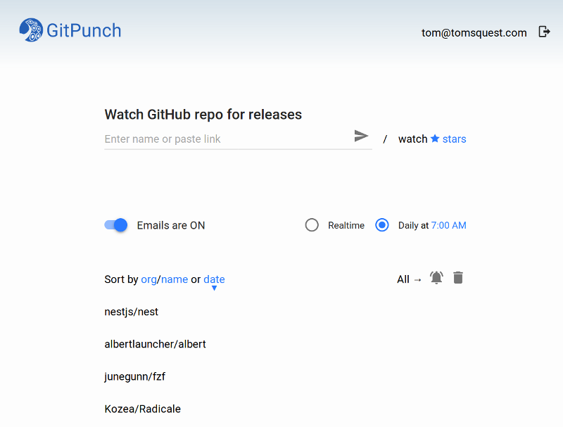

title: Better NPM'ing
author:
    name: "Thomas Queste"
    url: "tomsquest.com"
    email: "tom@tomsquest.com"
    twitter: "@ThomasQueste"
output: index.html
style: index.css 
controls: false
--
# Better NPM'ing

## Day-to-day Tips and Tricks

--
### Current Node version in IDE

**Problem**: When configuring Node/Typescript, the node path is version-dependent

--
### Current Node version in Tools

**Problem**: When configuring Node/Typescript, the node path is version-dependent

**Solution** _(with NVM)_: `$ export NVM_SYMLINK_CURRENT=true` links current node version in `~/.nvm/current

--
### Reproducible builds

**Problem**: Installing locally can differ from elsewhere (even with `package-lock.json`)

Version range are problematic: `"rxjs": "^6.2.2"`

--
### Reproducible builds

**Problem**: Installing locally can differ from elsewhere (even with `package-lock.json`)

**Solution**: `$ npm install --save-exact ...` or `-E` 

**Better solution**: Always exact: `$ npm config set save-exact true`

--
### Installing package

**Problem**: Install package only using `package-lock.json` without resolving and updating version ranges.

--
### Installing package

**Problem**: Install package only using `package-lock.json` without resolving and updating version ranges.

**Solution**: `$ npm ci`

↗ Speed (on CI and locally)

➕ Avoid dirty-ing the `package-lock.json`

--
### Global package

**Problem**: Polluting the global `node_modules` with global packages: nest-cli, create-react-apps (= hundreds of packages)

--
### Global package

**Problem**: Polluting the global `node_modules` with global packages: nest-cli, create-react-apps (= hundreds of packages)

**Solution**: `npx` runs a package without installing it (or find it locally in `node_modules`)

`$ npx cleaver`

--
### Security

**Problem**: Finding packages with security flaws

--
### Security

**Problem**: Finding packages with security flaws

**Solution**: `$ npm audit`, `$ npm audit fix`

➕ Fails the build given integrated it in CI

？ Scheduled build

--
### Updating packages

**Problem**: Updating dependency and finding the one that breaks the code

--
### Updating packages

**Problem**: Updating dependency and finding the one that breaks the code

**Solution**: `$ npx updr` update one update, then run the tests, then repeat

**Solution**: `$ npx npm-check -u` show a pretty menu of updates

--

--
### Follow Changelogs

**Problem**: Be notified of updates

--
### (Bonus) Follow Changelogs

**Problem**: Be notified of updates

**Solution**: evaluates Gitpunch.com

--

